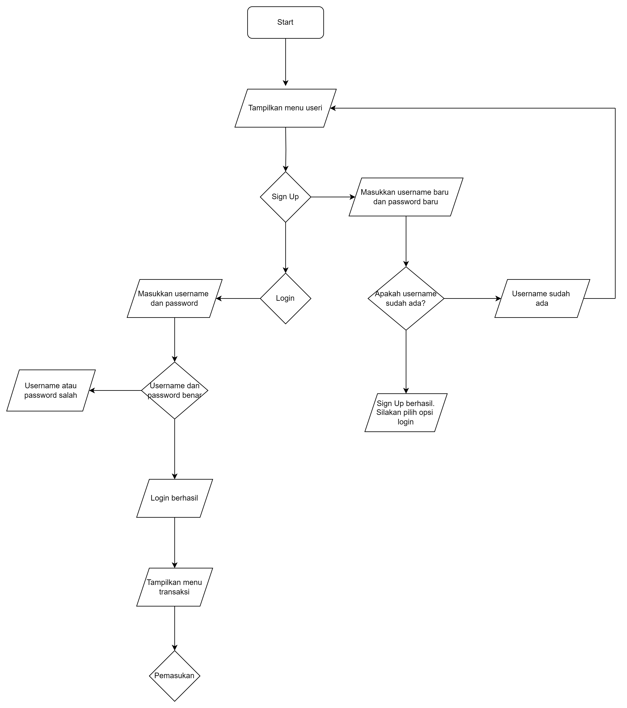

# KELAS A, KELOMPOK 5, DAFTAR ANGGOTA TEAM:
1. I0324034, Anggrek Dara Oktaviano, anggrekdara
2. I0324035, Aulia Tito Amanullah, auliatitoamanullah
3. I0324037, Azzahra Baqir Manna', baqirm

# DESKRIPSI PENGELOLAAN KEUANGAN PRIBADI
Aplikasi Pengelolaan Keuangan Pribadi yang dirancang untuk membantu pengguna dalam mencatat pemasukan dan pengeluaran pribadi, serta menampilkan laporan keuangan secara keseluruhan dan dapat mengetahui saldo akhir. Program ini berbasis teks dan berjalan di terminal, sehingga memungkinkan pengguna untuk menambahkan transaksi baru dan melihat laporan transaksi pada waktu realtime. Selain itu, program disertai dengan opsi sign up/login sehingga menambahkan keamanan bagi pengguna.

# FITUR FITUR APLIKASI YANG DIBUAT
1. Sign up dan Login pengguna
2. Input nominal dan deskripsi pemasukan dan pengeluaran
3. Perhitungan Saldo Akhir
4. Output berupa tabel laporan transaksi 

# FLOWCHART
