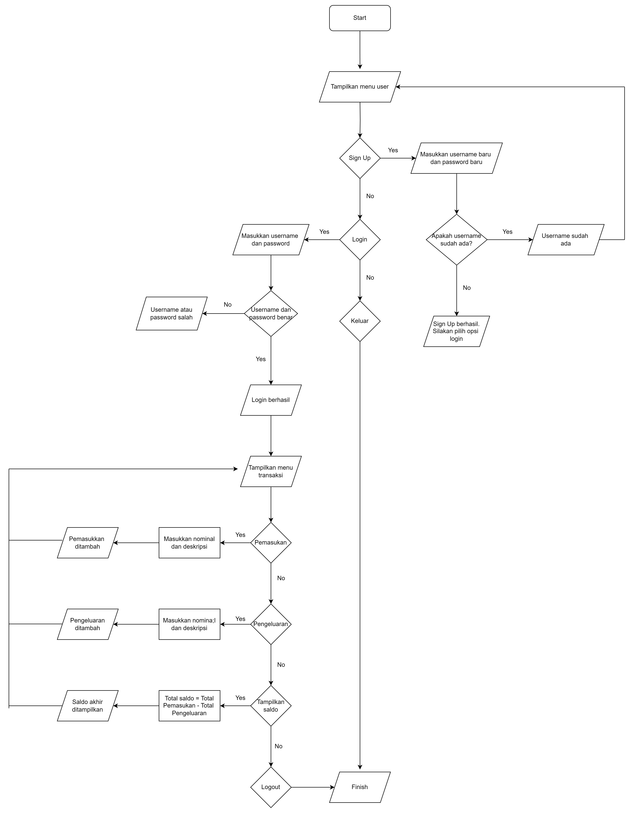

# KELAS A, KELOMPOK 5, DAFTAR ANGGOTA TEAM:
1. I0324034, Anggrek Dara Oktaviano, anggrekdara
2. I0324035, Aulia Tito Amanullah, auliatitoamanullah
3. I0324037, Azzahra Baqir Manna', baqirm

# DESKRIPSI PENGELOLAAN KEUANGAN PRIBADI
Aplikasi Pengelolaan Keuangan Pribadi adalah sebuah program dekstop yang dirancang untuk membantu pengguna dalam mengelola dan melacak keuangan pribadi secara terorganisir. Aplikasi ini memiliki berbagai fitur yang digunakan untuk membantu pengguna mencatat transaksi harian, menganalisis laporan keuangan, dan mengatur keuangan dengan lebih baik. Dengan antarmuka yang sederhana namun menarik, aplikasi ini cocok digunakan oleh pelajar, mahasiswa, pekerja, hingga pemilik usaha kecil.

# FITUR FITUR APLIKASI YANG DIBUAT
1. Sign up dan Sign in pengguna, setiap pengguna memiliki akun pribadi sehingga data keuangan mereka aman dan terpisah dari pengguna lain
2. Tambah transaksi, untuk mencatat transaksi dengan lebih detail sesuai tanggal yang diinginkan
3. Tabel Transaksi, semua transaksi yang dicatat ditampilkan dalam tabel 
4. Ringkasan saldo, berisi total pemasukan, total pengeluaran, dan saldo akhir
5. Penghitungan Real-Time, perubahan saldo dihitung secara otomatis setiap kali transaksi baru ditambahkan

# FLOWCHART

# FLOWCHART REVISI

# SITEMAP APLIKASI KEUANGAN PRIBADI
